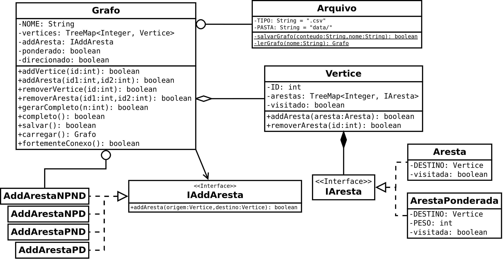

# Projeto de grafos

## Descrição

Este projeto é a reconstrução da implementação de um grafo para a disciplina de Teoria dos Grafos com técnicas de programação orientada a objetos.

## Versão atual



## Como executar

Para executar o projeto, basta executar o comando abaixo:

```bash
bash build.sh
```

## Licença

Este projeto está sob a licença GPL-3.0. Veja o arquivo [LICENSE](LICENSE) para mais detalhes.
